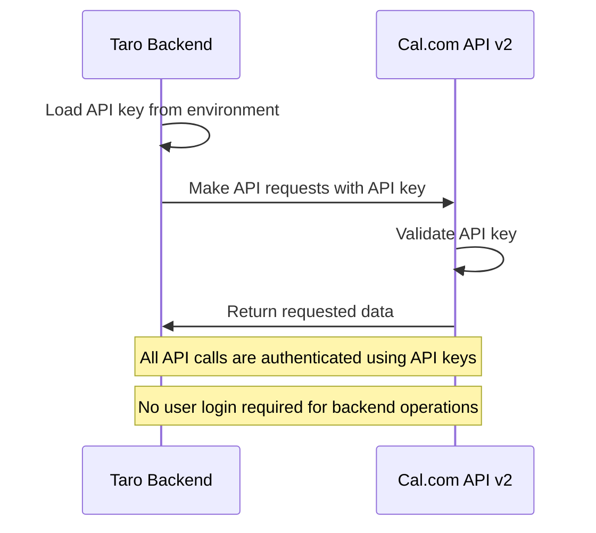
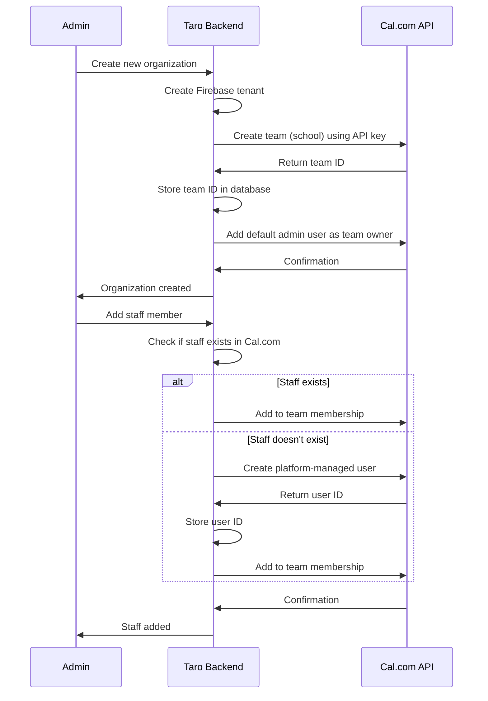
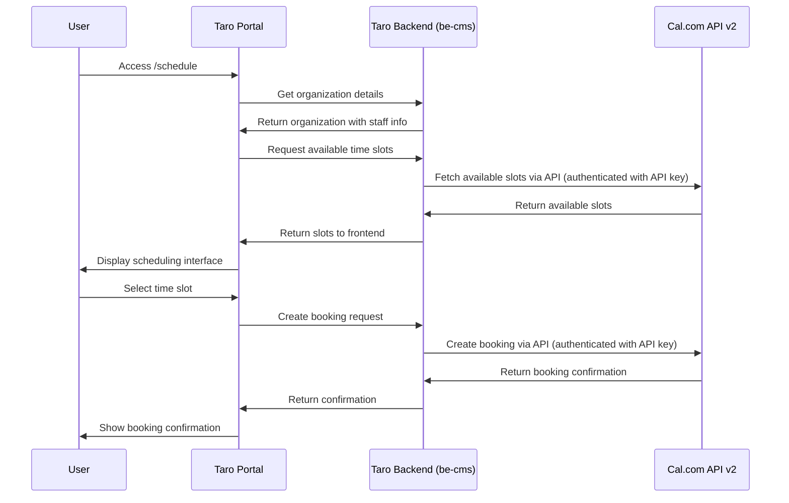
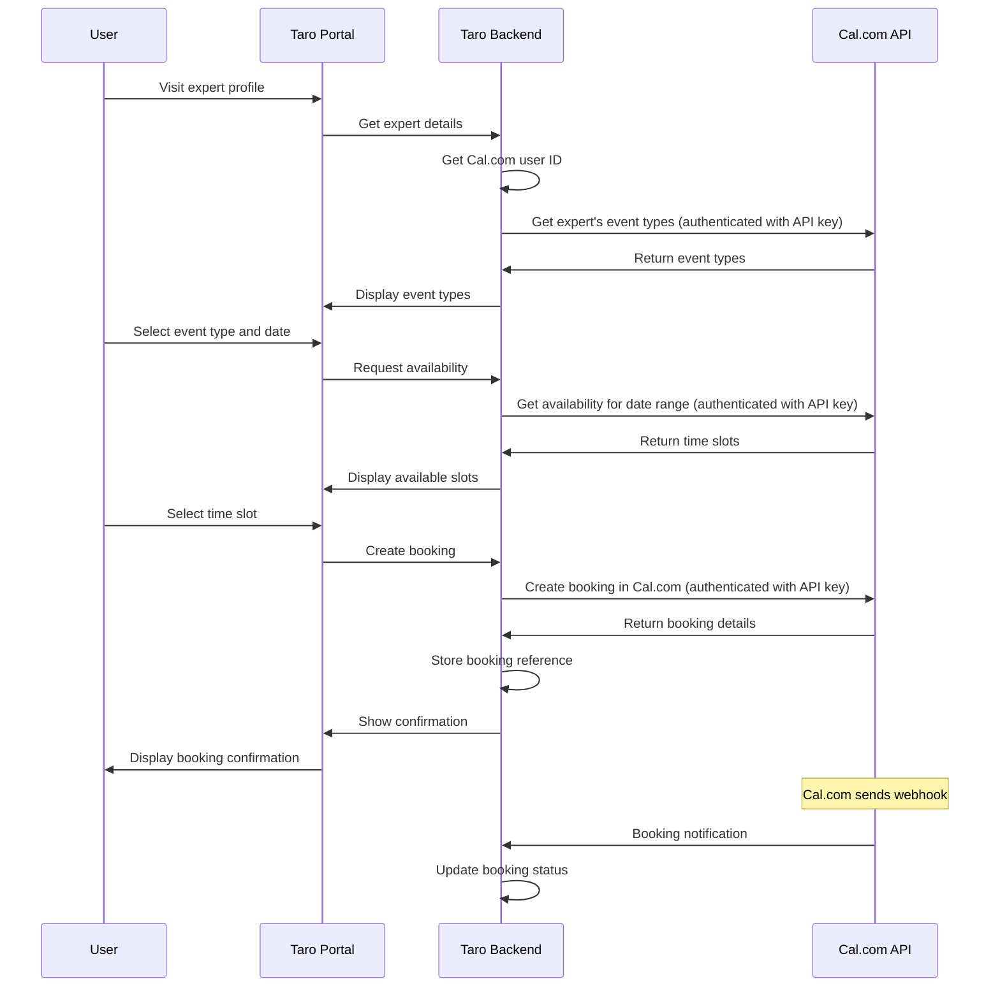

# Cal.com Integration Solution for Taro Portal

## Overview

This document outlines the integration of Cal.com API v2 with the Taro portal system. The integration will allow schools (organizations) to manage their staff scheduling through Cal.com while using a single default account for all team management.

## Key Requirements

1. Schools (organizations) in Taro are equivalent to Teams in Cal.com
2. Staff members in Taro are equivalent to Users in Cal.com
3. **A single default Cal.com account is created during seeding for managing all teams**
4. Staff members can be invited to teams without requiring separate Cal.com accounts with duplicate emails
5. Integration should be at the `/schedule` path in the portal

## Architecture

### System Components

1. **Taro Portal** (`/portal`) - Next.js frontend application
2. **Taro Backend CMS** (`/be-cms`) - NestJS backend API
3. **Cal.com API v2** (`/calcom-docker`) - Scheduling platform API

### Data Mapping

| Taro Entity | Cal.com Equivalent | Notes |
|-------------|-------------------|-------|
| Organization | Team | Schools are represented as teams |
| Staff | User | Staff members are represented as users |
| Expert | User with special role | Experts are users with specific permissions |

## Integration Approach

### 1. Single Account Management

To address the issue of duplicate emails:
- Create one default Cal.com user during seeding (Prisma seed)
- This single user acts as the administrator for all teams
- All staff members are invited as team members without creating separate Cal.com accounts
- Use Cal.com's team membership features to manage access across all schools
- Authentication to Cal.com API is done using API keys, not user credentials

### 2. API Authentication Flow



### 3. Team Creation and Management Flow



### 4. API Integration Flow



### 5. Booking Flow



## Implementation Details

### 1. Backend Integration (be-cms)

#### Environment Configuration
Add to `.env`:
```env
CALCOM_API_URL=http://localhost:5555/api/v2
CALCOM_API_KEY=your_generated_api_key
CALCOM_OAUTH_CLIENT_ID=your_oauth_client_id
CALCOM_DEFAULT_ADMIN_EMAIL=scheduling-admin@taro.edu.vn
```

#### Prisma Seed Update

Update your Prisma seed file to create the default Cal.com admin user:

```typescript
// prisma/seed.ts
import { PrismaClient } from '@prisma/client';

const prisma = new PrismaClient();

async function main() {
  // Note: The default admin user in Cal.com is created manually or via API
  // This seed only sets up the Taro database
  // The Cal.com default admin user is used for all team operations via API keys
  
  console.log('Taro database seeding completed');
  console.log('Make sure to create the default Cal.com admin user manually or via API');
  console.log('Default admin email should be:', process.env.CALCOM_DEFAULT_ADMIN_EMAIL);
}

main()
  .catch((e) => {
    console.error(e);
    process.exit(1);
  })
  .finally(async () => {
    await prisma.$disconnect();
  });
```

#### New Services

Create `calcom-integration.service.ts`:
```typescript
import { Injectable, Logger } from '@nestjs/common';
import { HttpService } from '@nestjs/axios';
import { ConfigService } from '@nestjs/config';
import { firstValueFrom } from 'rxjs';

@Injectable()
export class CalcomIntegrationService {
  private readonly logger = new Logger(CalcomIntegrationService.name);
  
  constructor(
    private readonly httpService: HttpService,
    private readonly configService: ConfigService,
  ) {}

  private getApiUrl(): string {
    return this.configService.get('CALCOM_API_URL');
  }

  private getApiKey(): string {
    return this.configService.get('CALCOM_API_KEY');
  }

  private getOAuthClientId(): string {
    return this.configService.get('CALCOM_OAUTH_CLIENT_ID');
  }

  private getDefaultAdminEmail(): string {
    return this.configService.get('CALCOM_DEFAULT_ADMIN_EMAIL');
  }

  private getAuthHeaders() {
    return {
      headers: {
        Authorization: `Bearer ${this.getApiKey()}`,
        'Content-Type': 'application/json',
      },
    };
  }

  // Create a team (school) in Cal.com
  async createTeam(organizationData: any): Promise<any> {
    try {
      const response = await firstValueFrom(
        this.httpService.post(
          `${this.getApiUrl()}/teams`,
          {
            name: organizationData.name,
            slug: organizationData.slug,
            isOrganization: true,
          },
          this.getAuthHeaders()
        )
      );
      return response.data;
    } catch (error) {
      this.logger.error('Error creating team in Cal.com', error);
      throw error;
    }
  }

  // Add a user to a team
  async addUserToTeam(userId: number, teamId: number, role: string = 'MEMBER'): Promise<any> {
    try {
      const response = await firstValueFrom(
        this.httpService.post(
          `${this.getApiUrl()}/teams/${teamId}/memberships`,
          {
            userId,
            role,
            accepted: true,
          },
          this.getAuthHeaders()
        )
      );
      return response.data;
    } catch (error) {
      this.logger.error('Error adding user to team in Cal.com', error);
      throw error;
    }
  }

  // Create a platform-managed user
  async createManagedUser(userData: any): Promise<any> {
    try {
      const response = await firstValueFrom(
        this.httpService.post(
          `${this.getApiUrl()}/users/platform`,
          {
            email: userData.email,
            username: userData.email.split('@')[0],
            name: userData.fullname,
            oAuthClientId: this.getOAuthClientId(),
          },
          this.getAuthHeaders()
        )
      );
      return response.data;
    } catch (error) {
      this.logger.error('Error creating managed user in Cal.com', error);
      throw error;
    }
  }

  // Check if user exists
  async findUserByEmail(email: string): Promise<any> {
    try {
      const response = await firstValueFrom(
        this.httpService.get(
          `${this.getApiUrl()}/users?email=${encodeURIComponent(email)}`,
          this.getAuthHeaders()
        )
      );
      return response.data;
    } catch (error) {
      this.logger.error('Error finding user in Cal.com', error);
      return null;
    }
  }

  // Get available time slots
  async getAvailableSlots(eventTypeId: number, dateFrom: string, dateTo: string): Promise<any> {
    try {
      const response = await firstValueFrom(
        this.httpService.get(
          `${this.getApiUrl()}/slots/availability`,
          {
            ...this.getAuthHeaders(),
            params: {
              eventTypeId,
              dateFrom,
              dateTo,
            },
          }
        )
      );
      return response.data;
    } catch (error) {
      this.logger.error('Error fetching availability from Cal.com', error);
      throw error;
    }
  }

  // Create a booking
  async createBooking(bookingData: any): Promise<any> {
    try {
      const response = await firstValueFrom(
        this.httpService.post(
          `${this.getApiUrl()}/bookings`,
          bookingData,
          this.getAuthHeaders()
        )
      );
      return response.data;
    } catch (error) {
      this.logger.error('Error creating booking in Cal.com', error);
      throw error;
    }
  }

  // Get default admin user ID
  async getDefaultAdminUserId(): Promise<number> {
    const adminEmail = this.getDefaultAdminEmail();
    const user = await this.findUserByEmail(adminEmail);
    if (!user) {
      throw new Error('Default admin user not found in Cal.com');
    }
    return user.id;
  }

  // Add default admin as team owner
  async addDefaultAdminAsOwner(teamId: number): Promise<any> {
    try {
      const adminUserId = await this.getDefaultAdminUserId();
      return await this.addUserToTeam(adminUserId, teamId, 'OWNER');
    } catch (error) {
      this.logger.error('Error adding default admin as team owner', error);
      throw error;
    }
  }
}
```

#### Updated Organization Service

Update `organization.service.ts` to integrate with Cal.com:

```typescript
import { LoggedAdminEntity } from '@/api/auth/entities/logged-admin.entity'
import { PrismaService } from '@/database'
import { Injectable } from '@nestjs/common'
import { Organization, Prisma, StaffInfo } from '@prisma/client'

import { UpdateOrganizationReqDto } from '@/api/organization/dto/update-organization.req.dto'
import { ErrorCodes } from '@/common/errors/common.errors'
import { AppError } from '@/common/exception/app.error'
import { BaseService } from '@/common/services/base.service'
import { FirebaseService } from '@/shared/firebase.service'
import { CreateOrganizationReqDto } from './dto/create-organization.req.dto'
import { OrganizationEntity } from './entities/organization.entity'
import { CalcomIntegrationService } from '@/shared/calcom-integration.service'

@Injectable()
export class OrganizationService extends BaseService {
  constructor(
    prisma: PrismaService,
    private readonly firebaseService: FirebaseService,
    private readonly calcomService: CalcomIntegrationService,
  ) {
    super(prisma)
  }
  
  async create(
    createOrganizationDto: CreateOrganizationReqDto,
    user: LoggedAdminEntity
  ) {
    const { domain, psychologicalConsultationInfo, socialMedia, ...rest } =
      createOrganizationDto
    const duplicate = await this.prismaService.organization.findFirst({
      where: {
        slug: domain,
      },
    })
    if (duplicate) {
      throw new AppError(ErrorCodes.ORGANIZATION_DOMAIN_ALREADY_EXISTS)
    }
    const tenant = await this.firebaseService.createTenant(domain)
    
    try {
      // Create organization in database
      const organization = await this.prismaService.organization.create({
        data: {
          ...rest,
          slug: domain,
          tenantId: tenant.tenantId,
          createdBy: user.id,
          updatedBy: user.id,
          psychologicalConsultationInfo:
            psychologicalConsultationInfo as Prisma.JsonValue,
          socialMedia: socialMedia as Prisma.JsonValue,
        },
      })

      // Create corresponding team in Cal.com
      const calcomTeam = await this.calcomService.createTeam({
        name: organization.name,
        slug: organization.slug,
      });

      // Update organization with Cal.com team ID
      await this.prismaService.organization.update({
        where: { id: organization.id },
        data: { 
          calcomTeamId: calcomTeam.id
        },
      });

      // Add default admin user as team owner
      await this.calcomService.addDefaultAdminAsOwner(calcomTeam.id);

      return organization
    } catch (error) {
      await this.firebaseService.deleteTenant(tenant.tenantId)
      throw error
    }
  }

  // ... rest of the methods
}
```

### 2. Portal Integration

#### Schedule Page Enhancement

Modify `/portal/src/app/schedule/page.tsx`:
```typescript
import { OrganizationsPublicService } from '@/api'
import { OrganizationInfo } from './components/organization-info'
import { notFound } from 'next/navigation'
import { detectTenant } from '@/lib/tenant/detection'

export default async function BookingPage() {
  const tenant = await detectTenant()
  const { data: organization } = await OrganizationsPublicService.getOrganizationV1({
    path: { slug: tenant.id },
    query: {
      includes: ['experts'],
    },
  })

  if (!organization) {
    return notFound()
  }

  return (
    <div className="relative mx-auto min-h-screen overflow-hidden">
      {/* Background Pattern */}
      <div className="absolute inset-0 -z-20">
        {/* Primary gradient background */}
        <div className="absolute inset-0 bg-gradient-to-br from-green-50/50 via-white to-blue-50/30" />
        
        {/* Decorative blur circles */}
        <div className="absolute -top-40 -left-20 h-[800px] w-[800px] rounded-full bg-gradient-to-br from-primary/20 to-primary/5 blur-[150px]" />
        <div className="absolute -bottom-40 -right-20 h-[800px] w-[800px] rounded-full bg-gradient-to-tl from-blue-400/20 to-primary/5 blur-[150px]" />
        <div className="absolute top-1/2 left-1/3 h-[600px] w-[600px] rounded-full bg-gradient-to-br from-green-300/10 to-transparent blur-[120px]" />
        
        {/* Pattern dots */}
        <div className="absolute inset-0 opacity-[0.02]" style={{
          backgroundImage: `radial-gradient(circle, #07A698 1px, transparent 1px)`,
          backgroundSize: '50px 50px'
        }} />
      </div>
      
      <OrganizationInfo organization={organization} />
    </div>
  )
}
```

### 3. How Access Works

#### 1. Creating Teams
When an admin creates a new organization in Taro:
1. Taro backend creates the organization in its database
2. Taro backend calls Cal.com API with the API key to create a team
3. No user login is required - the API key provides authentication
4. The default admin user is added as the team owner

#### 2. Adding Staff/Students
When adding staff or students to a team:
1. Taro backend checks if the user exists in Cal.com by email
2. If not, creates a platform-managed user via API
3. Adds the user to the team via API
4. All operations use the same API key for authentication

#### 3. Authentication Mechanism
- **API Key Authentication**: All backend-to-Cal.com API calls use API keys
- **No User Credentials**: The backend doesn't need to login as the default admin user
- **Secure Storage**: API keys are stored in environment variables
- **Platform OAuth Client**: Used for creating platform-managed users

## Database Schema Updates

Add these fields to your Prisma schema:

```prisma
model Organization {
  // ... existing fields
  calcomTeamId      Int?
}

model StaffInfo {
  // ... existing fields
  calcomUserId      Int?
}
```

## Security Considerations

1. **API Keys**: Store Cal.com API keys securely in environment variables
2. **User Data**: Only synchronize necessary user data
3. **Authentication**: Use proper authentication between Taro backend and Cal.com API
4. **Rate Limiting**: Implement rate limiting to prevent API abuse
5. **Data Encryption**: Encrypt sensitive data at rest

## Deployment Considerations

### 1. Docker Configuration

Update `calcom-docker/docker-compose.yaml` to ensure proper exposure of API v2:

```yaml
version: '3.8'
services:
  calcom-api-v2:
    build:
      context: ./calcom
      dockerfile: apps/api/v2/Dockerfile
    ports:
      - "5555:80"  # Expose API v2 on port 5555
    environment:
      - DATABASE_URL=postgresql://${POSTGRES_USER}:${POSTGRES_PASSWORD}@${DATABASE_HOST}/${POSTGRES_DB}
      - NEXTAUTH_SECRET=${NEXTAUTH_SECRET}
      # ... other environment variables
    depends_on:
      - database

  calcom:
    # ... existing configuration
    environment:
      - NEXT_PUBLIC_API_V2_URL=http://calcom-api-v2:80  # Internal Docker network URL
      # ... other environment variables
    depends_on:
      - calcom-api-v2
```

### 2. Networking

Ensure Taro backend can communicate with Cal.com API:
1. Both services should be on the same Docker network
2. If deploying separately, ensure network connectivity
3. Configure firewall rules if needed

### 3. Environment Variables

Required environment variables for Taro backend (`be-cms/.env`):
```env
# Cal.com Integration
CALCOM_API_URL=http://localhost:5555/api/v2
CALCOM_API_KEY=your_generated_api_key
CALCOM_OAUTH_CLIENT_ID=your_oauth_client_id
CALCOM_DEFAULT_ADMIN_EMAIL=scheduling-admin@taro.edu.vn
```

### 4. SSL/TLS

For production deployment:
1. Use HTTPS for all communications
2. Configure SSL certificates for all services
3. Ensure proper certificate management

### 5. OAuth Client Setup

To create an OAuth client for platform-managed users:
1. Access Cal.com Prisma Studio: `http://localhost:5555`
2. Navigate to the `PlatformOAuthClients` table
3. Create a new entry with:
   - `clientId`: A unique identifier (e.g., `taro-platform`)
   - `clientSecret`: A secure secret
   - `redirectUri`: Your portal URL
   - `permissions`: Appropriate permissions for user management

### 6. Default Admin User Setup

To create the default admin user in Cal.com:
1. Access the Cal.com web interface
2. Create an admin user with email: `scheduling-admin@taro.edu.vn`
3. Note the user ID for this account
4. This user will be the owner of all teams

## Testing Strategy

### 1. Unit Tests

Create unit tests for the CalcomIntegrationService:

```typescript
// calcom-integration.service.spec.ts
import { Test, TestingModule } from '@nestjs/testing';
import { CalcomIntegrationService } from './calcom-integration.service';
import { HttpService } from '@nestjs/axios';
import { ConfigService } from '@nestjs/config';
import { of } from 'rxjs';

describe('CalcomIntegrationService', () => {
  let service: CalcomIntegrationService;
  let httpService: HttpService;

  beforeEach(async () => {
    const module: TestingModule = await Test.createTestingModule({
      providers: [
        CalcomIntegrationService,
        {
          provide: HttpService,
          useValue: {
            get: jest.fn(),
            post: jest.fn(),
          },
        },
        {
          provide: ConfigService,
          useValue: {
            get: jest.fn((key: string) => {
              switch (key) {
                case 'CALCOM_API_URL':
                  return 'http://localhost:5555/api/v2';
                case 'CALCOM_API_KEY':
                  return 'test-api-key';
                case 'CALCOM_OAUTH_CLIENT_ID':
                  return 'test-client-id';
                case 'CALCOM_DEFAULT_ADMIN_EMAIL':
                  return 'scheduling-admin@taro.edu.vn';
                default:
                  return null;
              }
            }),
          },
        },
      ],
    }).compile();

    service = module.get<CalcomIntegrationService>(CalcomIntegrationService);
    httpService = module.get<HttpService>(HttpService);
  });

  it('should be defined', () => {
    expect(service).toBeDefined();
  });

  describe('createTeam', () => {
    it('should create a team successfully', async () => {
      const mockResponse = { data: { id: 1, name: 'Test Team' } };
      (httpService.post as jest.Mock).mockReturnValue(of(mockResponse));

      const result = await service.createTeam({ name: 'Test Team', slug: 'test-team' });
      expect(result).toEqual(mockResponse.data);
    });
  });
});
```

### 2. Integration Tests

Create integration tests for the complete flow:

```typescript
// schedule.e2e-spec.ts
import { Test, TestingModule } from '@nestjs/testing';
import { INestApplication } from '@nestjs/common';
import * as request from 'supertest';
import { ScheduleModule } from './schedule.module';

describe('ScheduleController (e2e)', () => {
  let app: INestApplication;

  beforeEach(async () => {
    const moduleFixture: TestingModule = await Test.createTestingModule({
      imports: [ScheduleModule],
    }).compile();

    app = moduleFixture.createNestApplication();
    await app.init();
  });

  it('/schedule/availability/1 (GET)', () => {
    return request(app.getHttpServer())
      .get('/schedule/availability/1?dateFrom=2023-01-01&dateTo=2023-01-31')
      .expect(200);
  });

  it('/schedule/book (POST)', () => {
    return request(app.getHttpServer())
      .post('/schedule/book')
      .send({
        expertId: 1,
        date: '2023-01-15',
        timeSlot: { start: '09:00', end: '09:30' },
      })
      .expect(201);
  });

  afterEach(async () => {
    await app.close();
  });
});
```

### 3. Mock Services

Create mock services for development:

```typescript
// calcom-integration.service.mock.ts
import { Injectable } from '@nestjs/common';

@Injectable()
export class CalcomIntegrationServiceMock {
  async createTeam(organizationData: any): Promise<any> {
    return {
      id: Math.floor(Math.random() * 1000),
      name: organizationData.name,
      slug: organizationData.slug,
    };
  }

  async addUserToTeam(userId: number, teamId: number): Promise<any> {
    return { success: true, membershipId: Math.floor(Math.random() * 1000) };
  }

  async createManagedUser(userData: any): Promise<any> {
    return {
      id: Math.floor(Math.random() * 1000),
      email: userData.email,
      username: userData.email.split('@')[0],
      name: userData.fullname,
    };
  }

  async getAvailableSlots(eventTypeId: number, dateFrom: string, dateTo: string): Promise<any> {
    // Generate mock time slots
    return {
      slots: [
        { id: 1, start: '09:00', end: '09:30' },
        { id: 2, start: '10:00', end: '10:30' },
        { id: 3, start: '11:00', end: '11:30' },
      ],
    };
  }

  async createBooking(bookingData: any): Promise<any> {
    return {
      id: Math.floor(Math.random() * 1000),
      ...bookingData,
      status: 'confirmed',
    };
  }
}
```

### 4. Load Testing

Use tools like Artillery or k6 for load testing:

```yaml
# load-test.yaml
config:
  target: "http://localhost:3001"
  phases:
    - duration: 60
      arrivalRate: 20
  variables:
    expertIds: ["1", "2", "3", "4", "5"]

scenarios:
  - name: "Get availability"
    flow:
      - get:
          url: "/schedule/availability/{{ expertIds[$randomInt(0, 4)] }}?dateFrom=2023-01-01&dateTo=2023-01-31"
  
  - name: "Create booking"
    flow:
      - post:
          url: "/schedule/book"
          json:
            expertId: "{{ expertIds[$randomInt(0, 4)] }}"
            date: "2023-01-15"
            timeSlot: 
              start: "09:00"
              end: "09:30"
```

## Implementation Roadmap

### Phase 1: Core Integration (2-3 weeks)
1. Set up Cal.com API v2 environment
2. Implement CalcomIntegrationService
3. Update Prisma seed to create default admin user
4. Create basic API endpoints in Taro backend
5. Develop frontend scheduling components
6. Implement organization and staff synchronization

### Phase 2: Booking Flow (1-2 weeks)
1. Implement complete booking flow
2. Add booking management features
3. Create user interface for booking management
4. Implement confirmation and notification systems

### Phase 3: Advanced Features (2-3 weeks)
1. Add webhook integration for real-time updates
2. Implement calendar synchronization
3. Add analytics and reporting features
4. Create admin dashboard for scheduling management

## Future Enhancements

1. **Webhook Integration**: Implement webhooks for real-time updates on booking changes
2. **Advanced Scheduling**: Support for recurring events and complex scheduling rules
3. **Calendar Sync**: Integrate with external calendar systems (Google Calendar, Outlook)
4. **Analytics**: Provide scheduling analytics and reporting
5. **Mobile App Integration**: Extend scheduling features to mobile applications
6. **AI-Powered Scheduling**: Implement intelligent scheduling suggestions
7. **Multi-language Support**: Add support for multiple languages in scheduling interface

## Monitoring and Maintenance

1. **Logging**: Implement comprehensive logging for all Cal.com API interactions
2. **Error Handling**: Create robust error handling and retry mechanisms
3. **Performance Monitoring**: Monitor API response times and system performance
4. **Backup and Recovery**: Implement backup strategies for scheduling data
5. **Security Audits**: Regular security audits of the integration

## Support and Documentation

1. **User Documentation**: Create user guides for the scheduling system
2. **API Documentation**: Document all new API endpoints
3. **Administrator Guide**: Create guide for system administrators
4. **Troubleshooting Guide**: Develop troubleshooting documentation for common issues

This integration will provide a seamless scheduling experience for schools while maintaining the single-account system requirement. The modular approach allows for future enhancements and scalability as the platform grows.